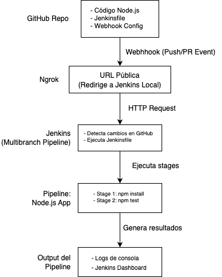

# Ejecución Automática de un Build de Node.js usando Webhook en Github

***Por: Andrés Burbano***

---
El presente documento muestra los pasos detallados para la implementación de un *pipeline multibranch* en Jenkins el cuál se ejecutará automáticamente con un webhook en GitHub al recibir un **Push** o un **Pull Request** en el repositorio.

---
## Tabla de contenido
1. [Introducción](#1-introducción)
2. [Instalación](#2-instalación)
   - [Requisitos previos](#21-requisitos-previos)
3. [Pipeline Multibranch para build de proyecto Node.js](#3-Pipeline-multibranch-para-build-de-nodejs)
  - [Paso 1: Crear el Pipeline Multibranch](#paso-1-crear-el-pipeline-multibranch)
  - [Paso 2: Agregar configuración al pipeline](#paso-2-agregar-configuración-al-pipeline)
  - [Paso 3: Ejecutar el Pipeline](#paso-3-ejecutar-el-pipeline)
  - [Paso 4: Ejecutar el Pipeline con un PUSH](#paso-4-ejecutar-el-pipeline-con-un-push)
  - [Paso 4.1: Verificación de ejecución con el PUSH](#paso-41-verificación-de-ejecución-con-el-push)
  - [Paso 5: Ejecutar el Pipeline con un PULL REQUEST](#paso-5-ejecutar-el-pipeline-con-un-pull-request)
  - [Paso 5.1: Verificación de ejecución con un PULL REQUEST](#paso-51-verificación-de-ejecución-con-un-pull-request)

---

## 1. Introducción

Este proyecto tiene como objetivo realizar una **prueba de concepto para crear un CI/CD de un proyecto en Node.js**  mediante el uso de Jenkins con un *pipeline bultibranch*. Este pipeline se debe ejecutar cuando en el repositorio del proyecto se detecte un ***Push*** o un ***Pull Request***. El proyecto de Node.js cuenta con una prueba integrada hecha con la herramienta Jest la cuál también se ejecutará en el pipeline.

Lo anterior se ejecutará con la ayuda de un Webhook en GitHub que tendrá configurado la url hacia el sistema Jenkins (el cuál será expuesto por `Ngrok`)


### Características:

#### Pipeline multibranch para build de Node.js

- ✅ Se añadirá el repositorio donde se encuentra el proyecto de Node.js y el archivo: Jenkinsfile
- ✅ Se añadirá las credenciales para acceder al repositorio (token de GitHub)
- ✅ Se establecerá cuál directorio tiene el archivo 'Jenkinsfile'

---
#### Diagrama de alto nivel para el la ejecución automática de un Build de Node.js usando Webhook en GitHub:


---

## 2. Instalación
### 2.1. Requisitos previos:

**1. Instalación de Jenkins:** asegurarse de que Jenkins esté instalado en la máquina Linux donde se ejecutarán los Pipelines y se deseen crear/eliminar los usuarios.

**2. Instalación de Plugin de Node.js:** Para poder ejecutar el proyecto de Node se debe contar con una versión instalada de node.js. Esto se puede hacer teniendo instalado en la máquina o de manera aislada mediante el plugin para Jenkins. Este último se puede instalar desde el apartado ```Manage Jenkins > Plugins > Availabe Plugins ```y buscando ```NodeJS Plugin```. Una vez instalado se debe ir al apartado  ```Manage Jenkins > Tools``` al final en ```NodeJS installations``` presionr el botón ```Add NodeJS```, se deben agregar los siguientes datos (acordes a la versión de node requerida y al archivo Jenkinsfile):
* Name: `nodejs21`   (Ojo debe ser el mismo que se establece en el archivo Jenkinsfile)
* Version: `NodeJS 21.7.3`


**3. Instalar ***Ngrok*** en el equipo que ejecutará Jenkins**: Ngrok permite exponer el servicio de Jenkins hacia internet sobre el puerto 8080 (con un dominio propio)

- **3.1 Creación de cuenta en Ngrok**: Para usar Ngrok se debe crear una cuenta en su web ```www.ngrok.com```, luego se obtendrá un token que se usará más adelante
  
##### (Los siguientes pasos se harán basándose en la documentación oficial: ```https://dashboard.ngrok.com/get-started/setup/linux```)

- **3.2 Instalación de Ngrok**: Ejecutar el siguiente comando en una terminal en el mismo Sistema operativo donde se encuentre corriendo Jenkins: 
```bash
curl -sSL https://ngrok-agent.s3.amazonaws.com/ngrok.asc \
	| sudo tee /etc/apt/trusted.gpg.d/ngrok.asc >/dev/null \
	&& echo "deb https://ngrok-agent.s3.amazonaws.com buster main" \
	| sudo tee /etc/apt/sources.list.d/ngrok.list \
	&& sudo apt update \
	&& sudo apt install ngrok 

```
- **3.3 Agregar el token generado de Ngrok**:
Luego, en la terminal ejecutar este comando:
```bash
ngrok config add-authtoken 2xxxxxxxxxxxxxxxxx_xxxxxxxxxxxxxxxxx
```
- **3.4 Desplegar el servicio Jenkins (puerto 8080) en Ngrok**: OJO se debe seleccionar Static Domain para que genere una url estática (para este caso generó: ```https://factual-elegant-parrot.ngrok-free.app```)
  <br>  

  En la terminal ejecutar el siguiente comando:
  ```bash
  ngrok http --url=factual-elegant-parrot.ngrok-free.app 8080
  ```
- **3.5 Probar que esté desplegado el servicio de Jenkins en la url de ngrok**: Se puede visitar la página ```https://factual-elegant-parrot.ngrok-free.app``` y debería mostrar la página de inicio de sesión de Jenkins

**4. Configuración del Webhook en GitHub**: En el repositorio donde se encuentra el proyecto de Node.js se debe crear un webhook, esto se hace desde la página de GitHub, seleccionando el repositorio, luego haciendo click en la rueda de ```Settings``` luego en ```Webhooks``` luego en el botón ```Add webhook```. 

- **4.1** Se debe configurar el Webhook con los siguientes parámetros:

  * Payload URL: ```https://factual-elegant-parrot.ngrok-free.app/github-webhook/```  (Ojo notar que se agregó a la url `/github-webhook`)
  * Content Type: `application/x-www-form-urlencoded`
  * Secret:  se deja vacío
  * SSL verification: (Marcar) "Enable SSL verification"
  * Which events would you like to trigger this webhook?: (Marcar) "Let me select individual events."
    * (Marcar) Pushes
    * (Marcar) Pull requests

  * Luego click en botón `Add webhook`
  <br>
- **4.2** Verificar que haya quedado bien configurado:
  - Click en el botón "Edit"
  - Click en pestaña "Recent Deliveries": Debe mostrar un id tipo *hash* con un icono de confirmación de color verde además de la palabra "ping" indicando que se realizó correctamente el ping a esa url de Jenkins.  Al darle click se puede apreciar la respuesta más detallada con un código 200 en el response mostrando lo siguiente:

    ```bash
    Headers

    Request URL: https://factual-elegant-parrot.ngrok-free.app/github-webhook/
    Request method: POST
    Accept: */*
    Content-Type: application/x-www-form-urlencoded
    User-Agent: GitHub-Hookshot/922ffd2
    X-GitHub-Delivery: 580ed640-b059-11ef-91ff-d727d6f27bbf
    X-GitHub-Event: ping
    X-GitHub-Hook-ID: 516361007
    X-GitHub-Hook-Installation-Target-ID: 897094887
    X-GitHub-Hook-Installation-Target-Type: repository
    ```
**5. Crear un token de GitHub:** En las configuraciones de la cuenta de GitHub (click en la foto de perfil, se abrirá una barra de menú lateral y ahí dar click en la rueda de `Settings`). Luego en el panel izquierdo click en `Developer Settings`, esto llevará a una ventana y se debe clickear en "Personal acces tokens" de ahí dar click en `Tokens (classic)`, luego click en el botón "Generate new token" y seleccionar `Generate new token (classic)`. Se debe establecer un tiempo de expiración y solamente dar click en el recuadro qeu dice `repo` (eso garantiza que el token solo tendrá acceso al repositorio y nada más). Finalmente click en el botón `Generate token`, esto llevará a la página anterior pero mostrará el token por *una única vez*, se debe copiar y guardar en un lugar seguro porque se utilizará para configurar el ***Pipeline de Jenkins***

### 3. Pipeline multibranch para build de Node.js

#### Paso 1: Crear el Pipeline Multibranch
Crear un nuevo item de tipo "Multibranch Pipeline" en Jenkins y asignarle un nombre, por ejemplo, "BuildNodeWebhook".

#### Paso 2: Agregar configuración al pipeline
En la sección de configuración del pipeline agregar lo siguiente
* Display name: `Build node with webhook`
* Description: `Este es un Pipeline que realiza el build automático de un proyecto realizado en Node.js. Este build se realizará cada vez que se produzca un push o un pull request al repositorio en GitHub del proyecto.`

- En la sección "Branch Source", en "Add Source" seleccionar `GitHub`
- En la seccion ***Credentials***, click en el botón `+ Add` luego en `Jenkins`, se abrirá una ventana y agregar las credenciales del repositorio: `username` y `Password` (se usará como password el mismo token que se generó en el paso 5 del apartado de ***Requisitos Previos***), luego dar click en el botón "Add". Luego se debe elegir las credenciales:  `nombre-usuario/*****`
- En la sección ***Repository HTTPS URL*** se debe copiar y pegar la url del repositorio donde se encuentra el proyecto de NodeJS, por ejemplo: `https://github.com/andres-b-devops/nodejs-helloworld-api-desafio.git`. 

  Luego se debe dar click en el botón "Validate" y debe mostrar que las credenciales están ok:  `Credentials ok. Connected to https://github.com/andres-b-devops/nodejs-helloworld-api-desafio`

- Las demás secciones como ***Behaviours*** se deben dejar sin modificar
- En la sección ***Build Configurations***, en Mode se debe seleccionar `by Jenkinsfile`
- En **Script Path** se debe poner la ruta hacia el directorio del repositorio en donde se encuentra el archivo 'Jenkinsfile', para este caso como no se encuentra dentro de ningún directorio dentro del repositorio se deja tal cual: `Jenkinsfile`. Click en botón `Save`

#### Paso 3: Ejecutar el Pipeline
Después de haber presionado click en el botón `Save` del paso anterior, Jenkins empezará a escanear el repositorio en busca de ramas (***branches***), luego ejecutará el Pipeline. Se debe dar click en el botón Status, si todo ha ido bien, mostrará un símbolo de aprobación en color verde.  Se puede validar también dando click en ese item que muestra la rama en la que se ejecutó, para este caso es la rama "main", esto llevará a otra página, ahí se debe buscar en el panel izquierdo, donde dice "Builds" y de ahí dar click en donde dice "#1" luego en "Console Output", debería mostrar todo el log de ejecución donde está la respuesta del test de Jest del proyecto.

#### Paso 4: Ejecutar el Pipeline con un PUSH
Dentro del repositorio se debe crear una rama llamada 'feature-1' a partir de la rama 'main', esto con el propósito de simular un nuevo feature que se creará y luego se hará un pull request. Después de crear esa rama se entraá en esta, se puede modificar algún archivo y hacer el respectivo commit y push, con esto se ejecutará automáticamente el Pipeline. Para este ejemplo se modificará el archivo README.md y el commit tendrá este mensaje 'Modificado para un PUSH'.

#### Paso 4.1: Verificación de ejecución con el PUSH:
En Jenkins, en la página del Pipeline Multibranch se puede apreciar como se ha creado la nueva rama 'feature-1' y además se encuentra ejecutándose automáticamente el Pipeline (debido al push anterior).    Si todo ha ido bien, mostrará un símbolo de aprobación en color verde.  Se puede validar también dando click en ese item que dice "feature-1", esto llevará a otra página, ahí se debe buscar en el panel izquierdo, donde dice "Builds" y de ahí dar click en donde dice "#1" luego en "Console Output", debería mostrar todo el log de ejecución, se puede apreciar que muestra el mensaje del commit: `Modificado para un PUSH`, más abajo muestra el contenido del log de la respuesta del test de Jest del proyecto.

Otra forma de verificarlo es mirando en la página de GitHub el log que se genera en el webhook, debe mostrar satisfactoriamente en verde el evento del `push`. Si se ingresa se puede ver en el payload la referencia a la rama:  `"ref": "refs/heads/feature-1"`

#### Paso 5: Ejecutar el Pipeline con un PULL REQUEST
Una vez hecho el push en la rama 'feature-1', en la página principal del repositorio de GitHub, se puede apreciar que en la parte superior aparece en color amarillo: '**feature-1** had recent pushes 1 minute ago', al lado derecho en un botón color verde dice: `Compare & pull request`, se debe dar click ahí, esto llevará a otra página que permitirá crear el Pull Request. Ahí aparece como título el que se generó en el commit anterior 'Modificado para un PUSH', se debe agregar la siguiente descripción: 'Realizando un PULL REQUEST', de ahí dar click en el botón `Create pull request` (esto disparará el webhook en el evento `pull_request.opened`). Luego se debe dar click en el botón `Merge pull request`, de ahí click en `Confirm merge`. Finalmente mostrará: Pull request successfully merged and closed (esto disparará el webhook en el evento `pull_request.closed`)

#### Paso 5.1: Verificación de ejecución con un PULL REQUEST:
Una vez se cerró el Pull Request en los pasos anteriores, ir a Jenkins, luegen la página del Pipeline Multibranch dar click en 'feature-1', esto llevará a otra página, ahí en el panel izquierdo en la sección "Builds" se puede apreciar que aparece '#2', ahí dar click en "Console Output", debería mostrar todo el log de ejecución, se puede apreciar que muestra el mensaje `Merge pull request #1 from andres-b-devops/feature-1` más abajo muestra el contenido del log de la respuesta del test de Jest del proyecto.

También se puede apreciar que en Jenkins, en la página del Pipeline Multibranch, apareceió en la pestalla "Pull Requests" un item con este nombre "Modificado para un PUSH (#1)"

Otra forma de verificarlo es mirando en la página de GitHub el log que se genera en el webhook, debe mostrar satisfactoriamente en verde 2 eventos: que se abrió (pull_request.opened) y cerró (pull_request.closed) dicho Pull Request. Si se ingresa en cada uno se puede ver la respuesta de Jenkins
